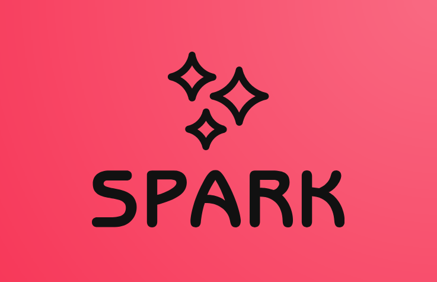

# 🔥 Spark – Bot
**Spark** est un bot personnel développé en Rust qui facilite l'exécution de tâches complexes de manière transparente. Son objectif est simple : automatiser les processus difficiles pour les rendre accessibles et intuitifs.
## 🚀 Objectif
Spark ne crée pas, il **fait**. Conçu pour être polyvalent et efficace, il vous assiste dans diverses tâches sans complexité inutile.

## 🛠️ Technologies
- Langage : **Rust**
- Architecture : Modulaire et extensible
- Performance : Conçu pour être rapide et efficace

## Architecture

src/
├── main.rs
├── bot.rs
├── core/
│   ├── command_info.rs
│   ├── contexts.rs
│   └── input.rs
│   └── structures.rs
├── commands/
│   └── help.rs
│   └── localize.rs
│   └── pomodoro.rs
│   └── recall.rs
│   └── remember.rs
│   └── remind.rs
│   └── start.rs
│   └── todo.rs

## Commandes disponibles
    /start   : Démarrer une nouvelle tâche
    /remember: Mémoriser une information
    /recall  : Afficher ce que Spark a mémorisé
    /help    : Afficher la liste des commandes
    /exit    : Quitter le programme
    /pomodoro: Lancer un minuteur Pomodoro
    /localize: Me localiser dans le monde (IP)
    /todo    : Gérer une liste de tâches
    /remind  : Créer un rappel pour une certaine durée